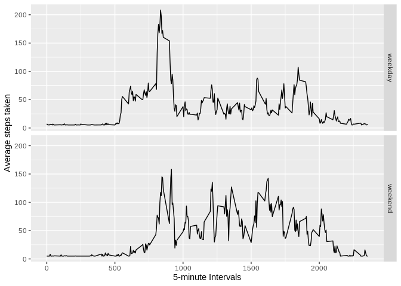

Load the following packages.


```r
library(dplyr)
library(lubridate)
library(ggplot2)
```

Read in the data, amd. Typify na values. 


```r
amd <- read.csv(unz('./data/repdata_data_activity.zip', filename = 'activity.csv'), 
                stringsAsFactors = F, header=T, na.strings = 'NA')
```

See the structure


```r
str(amd)
```

```
## 'data.frame':	17568 obs. of  3 variables:
##  $ steps   : int  NA NA NA NA NA NA NA NA NA NA ...
##  $ date    : chr  "2012-10-01" "2012-10-01" "2012-10-01" "2012-10-01" ...
##  $ interval: int  0 5 10 15 20 25 30 35 40 45 ...
```

The date column is a character vector. Change to a date format.


```r
amd$date <- ymd(amd$date)
```

### Task 1: What is mean total number of steps taken per day?


Calculate the total number of steps taken per day?


```r
total_steps_day <- amd %>% group_by(date) %>% summarize(Total_steps=sum(steps, na.rm=T))
print(head(total_steps_day))
```

```
## # A tibble: 6 x 2
##   date       Total_steps
##   <date>           <int>
## 1 2012-10-01           0
## 2 2012-10-02         126
## 3 2012-10-03       11352
## 4 2012-10-04       12116
## 5 2012-10-05       13294
## 6 2012-10-06       15420
```

Histogram of total steps taken per day


```r
ggplot(total_steps_day, aes(Total_steps)) + geom_histogram()
```

```
## `stat_bin()` using `bins = 30`. Pick better value with `binwidth`.
```

<!-- -->

Mean total number of steps taken per day


```r
avgSteps <- mean(total_steps_day$Total_steps)
```

Mean total step is 9354.2295082

Median total number of steps taken per day


```r
midSteps <- median(total_steps_day$Total_steps)
```

Median total step is 10395

### Task 2: What is the average daily activity pattern?

Make a time series plot (i.e. \color{red}{\verb|type = "l"|}type = "l") of the 5-minute interval (x-axis) and the average number of steps taken, averaged across all days (y-axis)


```r
f <- amd %>% group_by(interval) %>% summarise(avg_steps=mean(steps, na.rm=T))
ggplot(f, aes(interval, avg_steps)) + geom_line() + ylab('Average steps taken') + 
    xlab('5-minute Intervals')
```

<!-- -->

Which 5-minute interval, on average across all the days in the dataset, contains the maximum number of steps?


```r
g <- amd %>% group_by(interval) %>% summarize(avg_step=mean(steps, na.rm=T))
ans <- amd$interval[which(g$avg_step==max(g$avg_step))]
```

The 5-minute interval with the maximum number of steps is 835

### Task 3: Imputing missing values

Calculate and report the total number of missing values in the dataset (i.e. the total number of rows with \color{red}{\verb|NA|}NAs)


```r
missing <- sum(is.na(amd))
```

Total number NA's is 2304

Devise a strategy for filling in all of the missing values in the dataset. The strategy does not need to be sophisticated. For example, you could use the mean/median for that day, or the mean for that 5-minute interval, etc.

#### Note: 

1. After calculating the mean of steps across each day, some days have really low values

2. Most days have values ranging from 25 to 50

3. Remove rows of days whose mean values are very low

4. Calculate the mean of the rest

5. replace NA with that mean

Create a new dataset that is equal to the original dataset but with the missing data filled in.


```r
q <- amd %>% group_by(date) %>% summarise(missing=mean(steps))
x <- q[-c(1,8,2,25,32,35,39,40,41,45,46,61), ]

imputeValue <- floor(mean(x$missing))

amd$steps <- replace(amd$steps, is.na(amd$steps), imputeValue)
```

Make a histogram of the total number of steps taken each day and Calculate and report the mean and median total number of steps taken per day. Do these values differ from the estimates from the first part of the assignment? What is the impact of imputing missing data on the estimates of the total daily number of steps?


```r
total_steps_day <- amd %>% group_by(date) %>% summarize(Total_steps=sum(steps, na.rm=T))
ggplot(total_steps_day, aes(Total_steps)) + geom_histogram(bins=20)
```

<!-- -->

Mean total steps

```r
mean(total_steps_day$Total_steps)
```

```
## [1] 10865.05
```
The mean total step changed from 9354.2295082. 

Median total steps

```r
median(total_steps_day$Total_steps)
```

```
## [1] 11458
```
The median total step changed from 10395.

### Task 4: Are there differences in activity patterns between weekdays and weekends?

Create a new factor variable in the dataset with two levels – “weekday” and “weekend” indicating whether a given date is a weekday or weekend day.

```r
amd$weekSig <- weekdays(amd$date)

amd[amd$weekSig!='Saturday' & amd$weekSig!='Sunday', ]$weekSig <- 'weekday'
amd[amd$weekSig=='Saturday' | amd$weekSig=='Sunday', ]$weekSig <- 'weekend'

amd$weekSig <- as.factor(amd$weekSig)
```

Make a panel plot containing a time series plot (i.e. \color{red}{\verb|type = "l"|}type = "l") of the 5-minute interval (x-axis) and the average number of steps taken, averaged across all weekday days or weekend days (y-axis). See the README file in the GitHub repository to see an example of what this plot should look like using simulated data.


```r
f <- amd %>% group_by(weekSig, interval) %>% summarise(avg_steps=mean(steps, na.rm=T))

ggplot(f, aes(interval, avg_steps)) + geom_line() + 
    ylab('Average steps taken') + xlab('5-minute Intervals') +
    facet_grid(weekSig~.)
```

<!-- -->
